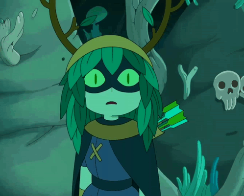

# Hey there, I'm Jeferson Escudero Rua! 

<table width="100%">
  <tr>
    <td width="60%">
      <h3>I'm a Full-Stack artisan and aspiring Software Architect who loves creating seamless digital experiences.</h3>
      

        🔹 <b>Problem Solver:</b> Whether it's crafting scalable backend architectures or hacking together native desktop apps, I enjoy solving complex puzzles.   
        🔹 <b>Versatile Builder:</b> From employability platforms and custom POS systems to real-time WebSockets and cross-platform monorepos.   
        🔹 <b>DevOps Enthusiast:</b> If it can be built, I'm probably figuring out how to dockerize it.
      

    </td>
    <td width="40%" align="center">
      
    </td>
  </tr>
</table>

---

## ⚔️ The Arsenal (Technical Skills)

### 🧠 Core Languages
 
 

### 🧱 Frameworks & Ecosystems
**Back-End:**  
 

**Front-End & Mobile/Desktop:**  

### 🛠️ Infrastructure & DevOps

### 🛡️ Security & Integrations
- JWT Authentication & Role-Based Access Control (RBAC)
- Password encryption (bcrypt)
- Real-time Comms (WebSockets , Socket.io)
- Third-party APIs (HuggingFace, Cloudinary, n8n, WhatsApp Evolution API)

---

## 🗺️ Current Quest 
I'm currently building a **massive Cross-Platform POS (Point of Sale) Monorepo**. 
- **The Brain:** NestJS backend securely tunneled to the world via Cloudflare Zero Trust.
- **The Memory:** PostgreSQL + Redis cache managed by Docker Compose.
- **The Faces:** Mobile apps orchestrated with Expo (React Native), Desktop apps compiled with Tauri (Rust), and a snappy Web frontend powered by Vite.
- All syncing in real-time, because why settle for less?

## 🌱 Side-Quests
- Advanced performance optimization techniques.
- Deepening my knowledge in the Rust ecosystem.
- Local LLM models orchestration (Ollama) & AI-assisted development.

---

## 🤝 Let's Connect!
- 💼 **LinkedIn:** [ljeferr](https://linkedin.com/in/ljeferr)
- 📧 **Email:** [ljeferr@gmail.com](mailto:ljeferr@gmail.com)
- 🐙 **GitHub:** [ljeee](https://github.com/ljeee)

   
  <i>⭐️ From <a href="https://github.com/ljeee">ljeee</a> with 🖤</i>

